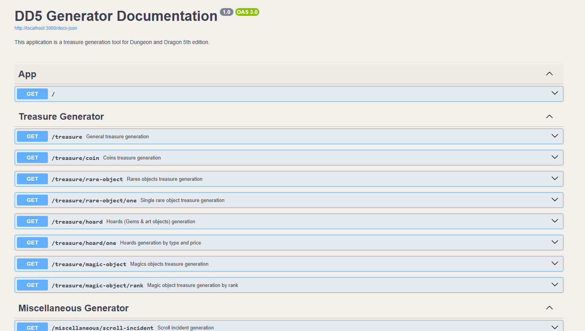

# DD5 Generator

/!\ _This application is currently under development._

This application is a treasure generation tool for Dungeon and Dragon 5th edition.  
It sets up a nestJs server that generates treasures on port 3000.

Treasure generation is based on the following website: https://5e-drs.fr/les-tresors/

The file folder contains the generation tables used by the app (taken from the site and formatted)

## How to run

Follow these steps to set up and run the application locally.

### Prerequisites (tested on 19 November 2024)

- Node.js v23.2.0
- npm v10.9.0

### Run

- Go to `dd5-generator` directory (`cd .\dd5-generator\`)
- Install the dependencies : `npm install`
- Run the application `npm run start`
- Open `http://localhost:3000/`

### Documentation

Go to `http://localhost:3000/docs` to consult swagger documentation

## Screenshots

## TODO :

- Handle "bonus" part in treasure C generation: https://5e-drs.fr/les-tresors/#table-c
- Handle individual generation by monsters for treasure A https://5e-drs.fr/les-tresors/#determiner-un-tresor
- Transform string result into object with meta-data (type, link to description, ...)
